## 一、初见vue

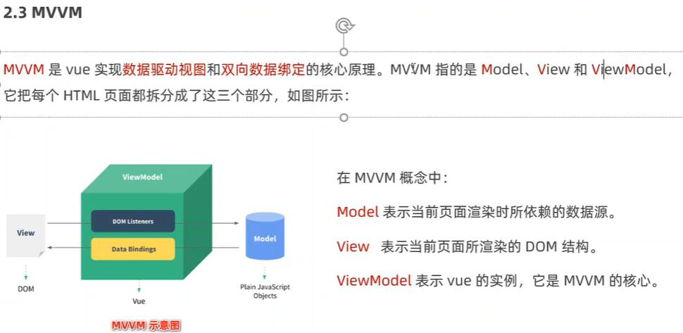

## 二、vue指令与过滤器

 
<b>v-text 会覆盖元素内部原有的内容 

### 过滤器(vue3已经砍掉了)

## 侦听器

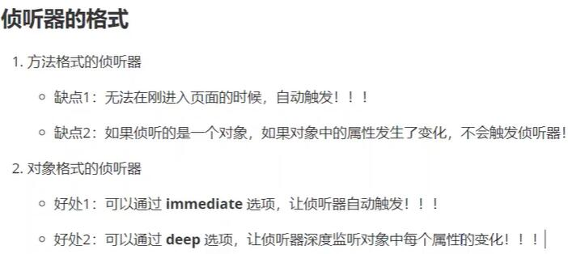
## 计算属性

## axios

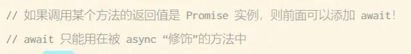
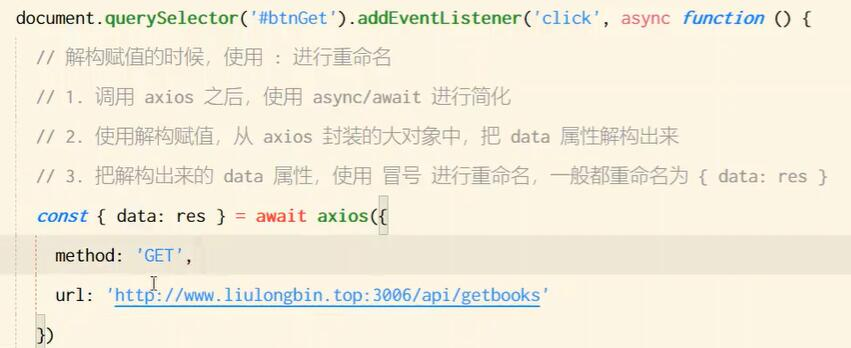
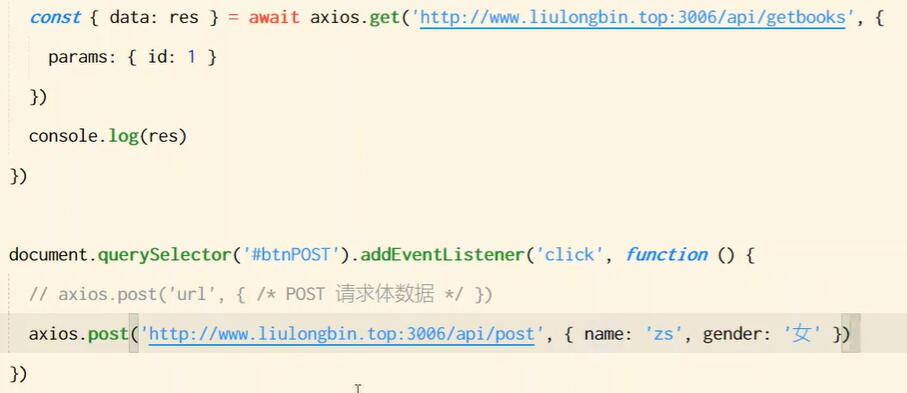
## vue-cli
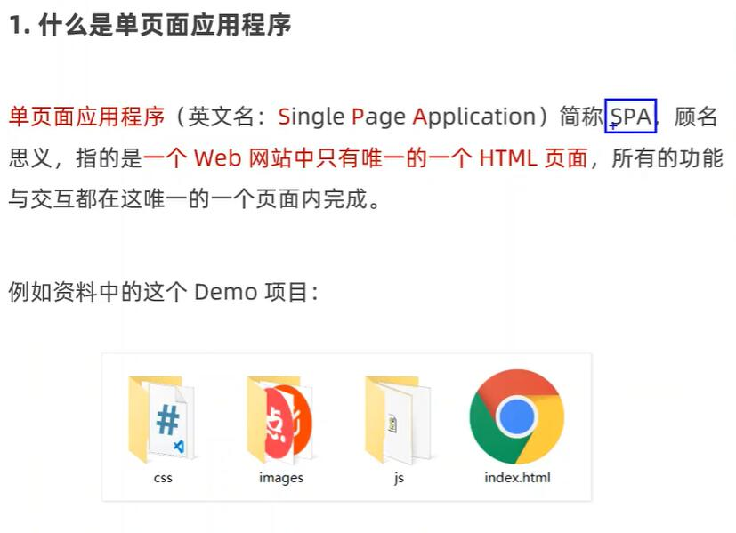
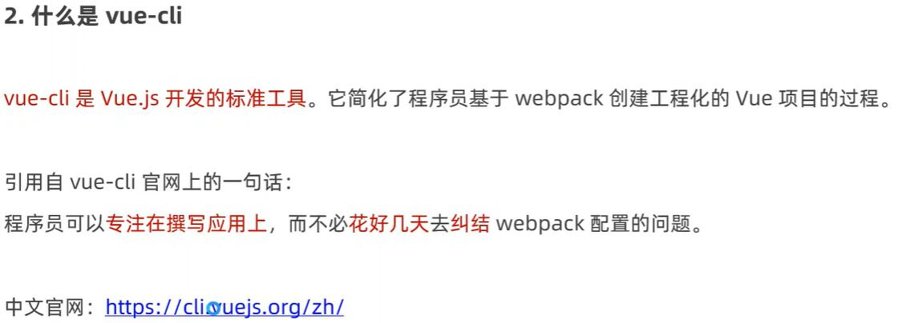
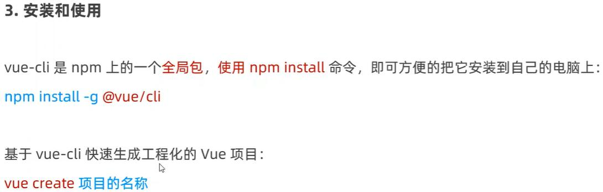
#### 创建步骤
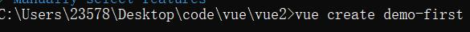
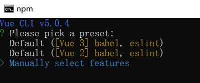

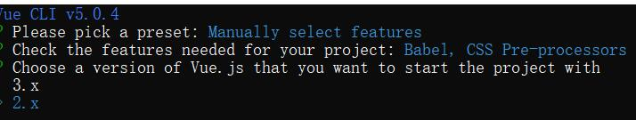
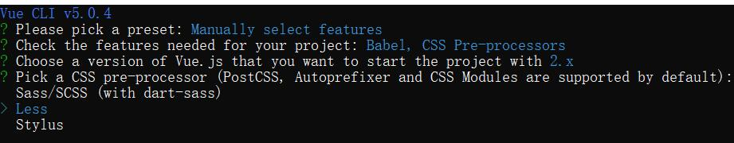
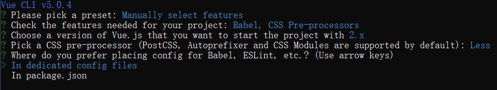

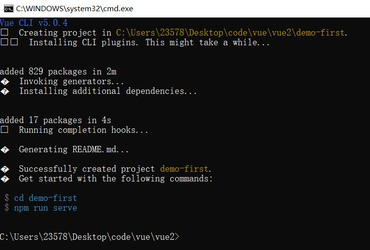
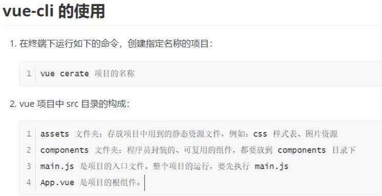
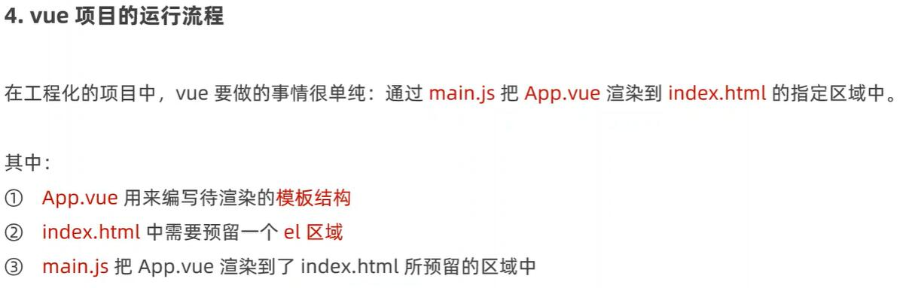
#### APP.vue 定义页面ui结构
## 组件化开发
#### 组件是对UI结构的复用

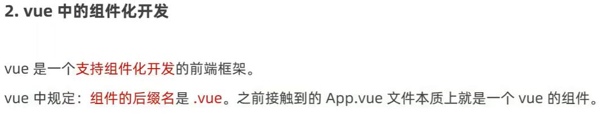
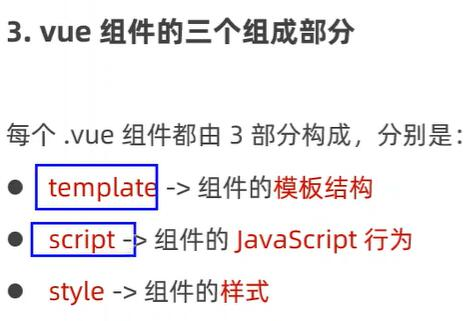
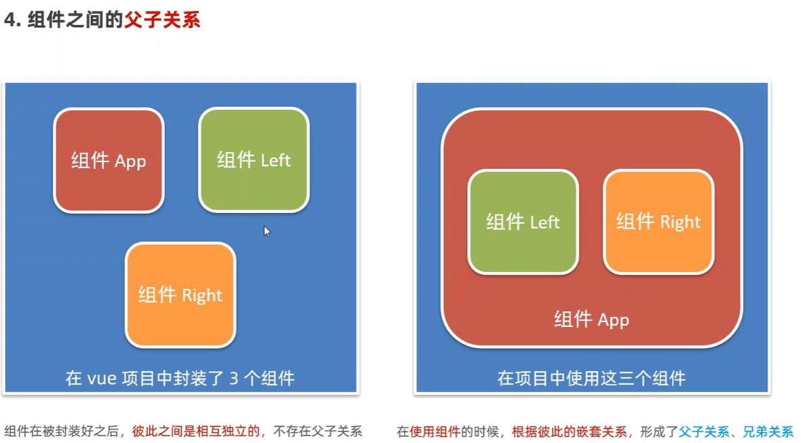
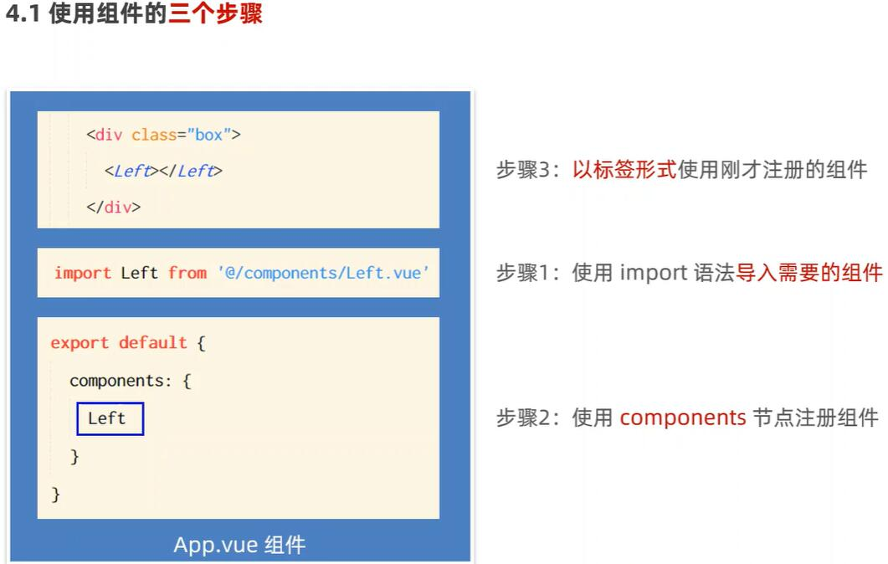
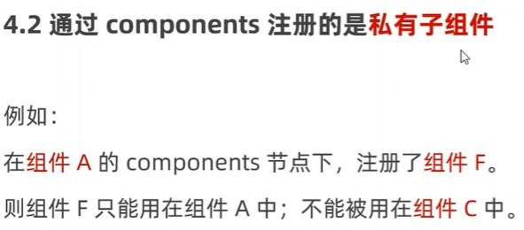
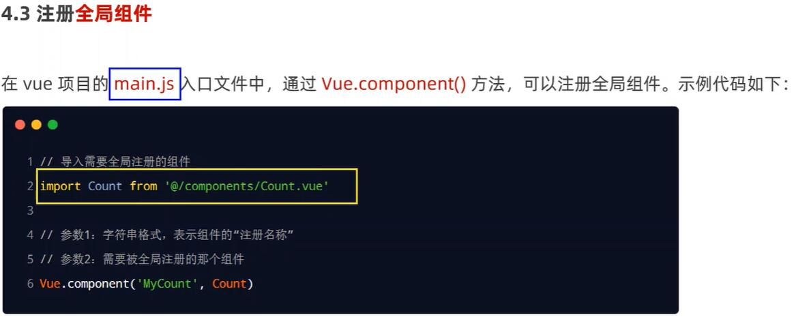
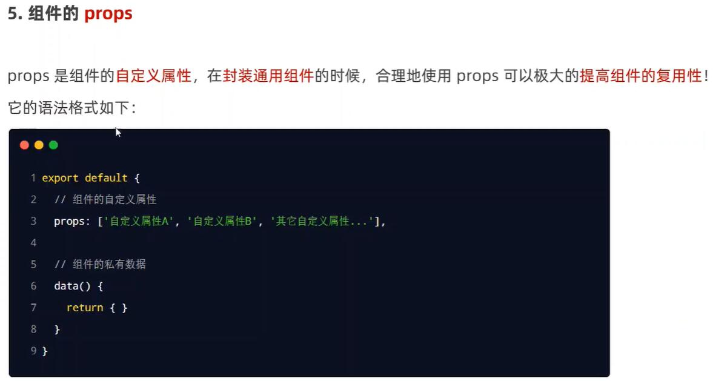
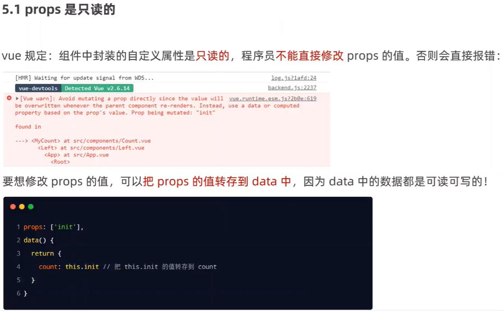
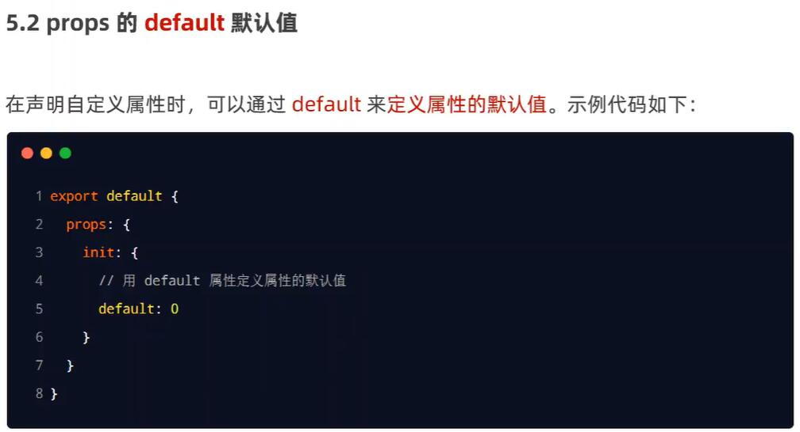
 