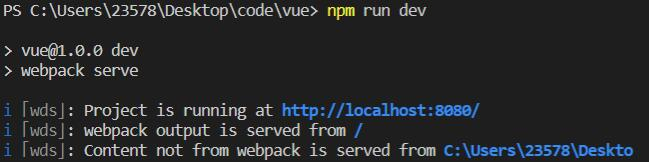

## 一、webpack

 
<b>这里webpack-cli 4.9.0 
 
<b>操作完网页还是没变化可输入 set NODE_OPTIONS=--openssl-legacy-provider 命令</b> 

### webpack中的插件

 
<b>引用的script要变成根目录下的main.js 

安装html-webpack-plugin 让8080首页显示的不再是文件而是index.html

### webpack loader 加载器

### 打包发布

### Source Map

